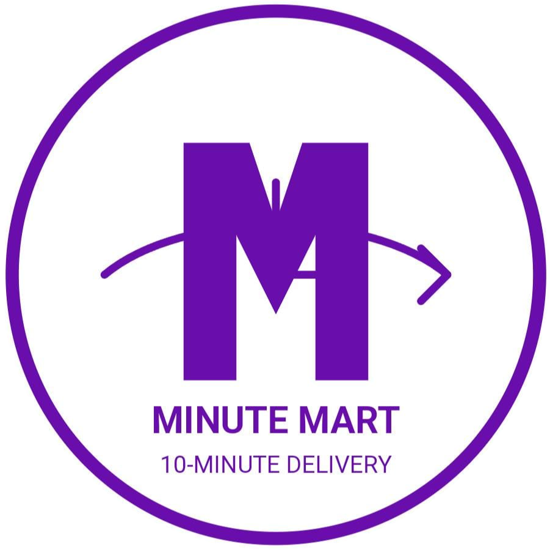

# MinuteMart 🛒



A full-stack grocery delivery platform connecting local vendors with customers for quick essentials delivery.

## Key Features ✨

- **Multi-role System**: Separate interfaces for Customers, Vendors, and Delivery Partners
- **Location-Based Services**: Google Maps API integration for address selection
- **Real-time Inventory**: MySQL database with product management
- **Shopping Cart**: Add/remove items with quantity control
- **Order Tracking**: Real-time order status updates
- **Secure Authentication**: JWT-based login with password encryption
- **Admin Dashboard**: Comprehensive management interface

## Tech Stack 💻

### Frontend
- **Core**: HTML5, CSS3, JavaScript (ES6+)
- **UI Components**: Custom CSS with Font Awesome icons
- **Maps Integration**: Google Maps JavaScript API with Places Autocomplete
- **Responsive Design**: Mobile-first approach

### Backend
- **Server**: Node.js with Express.js
- **Database**: MySQL with complex relational schema
- **Authentication**: bcryptjs for password hashing
- **Security**: Crypto for password reset tokens
- **Email**: Nodemailer for OTP and notifications
- **File Uploads**: Multer for product images

### APIs
- **Google Maps API**: For location services
- **Custom REST API**: 50+ endpoints for all operations

## Installation ⚙️

### Prerequisites
- Node.js (v14+)
- MySQL (v8+)
- Google Cloud API key with Maps JavaScript API and Places API enabled

### Setup Steps

1. **Clone the repository**:
   ```bash
   git clone https://github.com/anushka2030/MinuteMart.git
   cd MinuteMart
